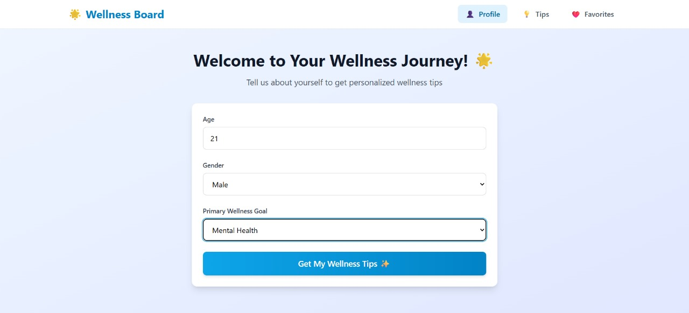
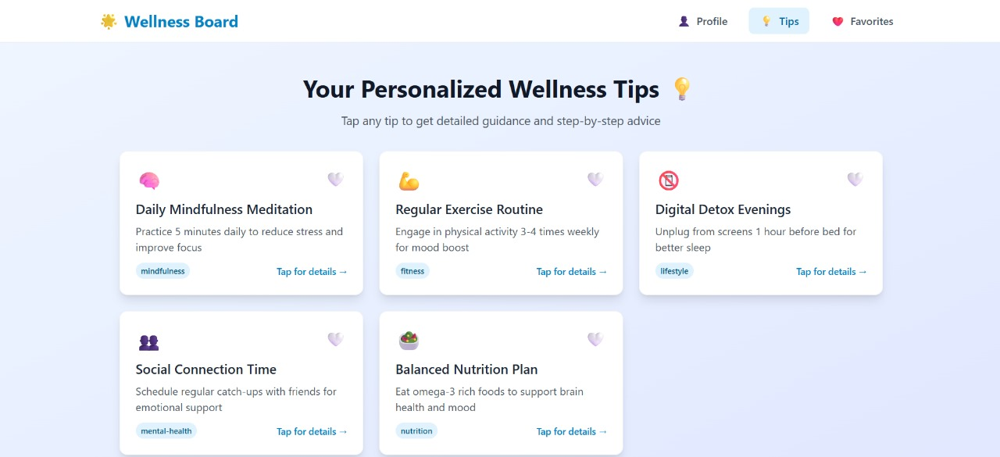
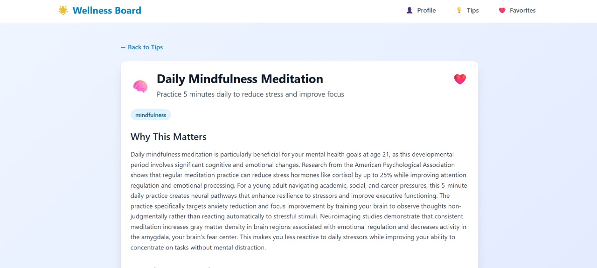
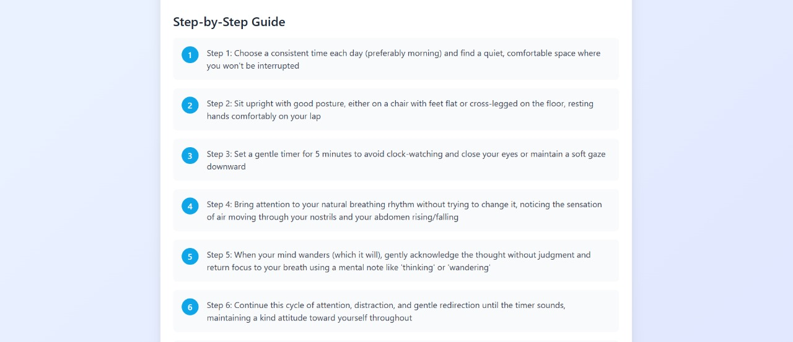
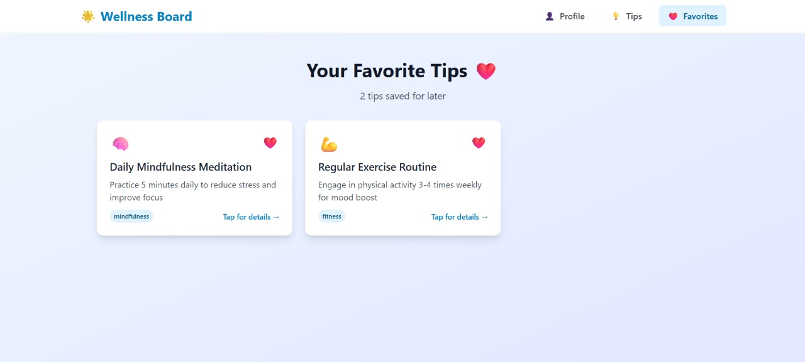

# 🌟 Wellness Board

A modern, AI-powered wellness application built with React, TypeScript, Vite, and Tailwind CSS. Get personalized wellness tips based on your profile and save your favorites locally.

## 1. Project Setup & Demo

### Web Setup
Run the following commands to launch the application locally:

```bash
npm install && npm start
```

**Note:** The project uses `npm run dev` instead of `npm start` for development. Use:
```bash
npm install && npm run dev
```

### Demo
- **Local Development**: After running the setup commands, the app will be available at `http://localhost:5173`
- **Hosted Demo**: [Add your deployed URL here when available]

### Environment Setup
Before running the application, you need to set up environment variables:

1. Create a `.env` file in the root directory
2. Add your OpenRouter API key:
```env
VITE_OPENROUTER_API_KEY=your_openrouter_api_key_here
VITE_AI_MODEL=deepseek/deepseek-chat-v3.1
VITE_DEFAULT_TIP_COUNT=5
```

Get your API key from [OpenRouter](https://openrouter.ai/keys).

## 2. Problem Understanding

### Problem Statement
The goal was to create a personalized wellness application that:
- Collects user profile information (age, gender, wellness goals)
- Generates AI-powered, personalized wellness tips
- Provides detailed explanations for each tip
- Allows users to save favorite tips locally
- Offers a modern, responsive user interface

### Assumptions Made
1. **AI Service**: Used OpenRouter with DeepSeek-V3.1 model for generating wellness content
2. **Data Persistence**: Implemented local storage for favorites (no backend required)
3. **User Flow**: Linear progression from profile setup → tips generation → detailed views → favorites
4. **Responsive Design**: Mobile-first approach with Tailwind CSS
5. **Content Categories**: Predefined wellness categories (fitness, nutrition, mental-health, sleep, mindfulness, lifestyle)

## 3. AI Prompts & Iterations

### Initial Prompts
**Tip Generation Prompt:**
```
Generate 5 personalized wellness tips for a [age]-year-old [gender] with the wellness goal: "[goal]".

For each tip, provide:
1. A short, catchy title (max 6 words)
2. A brief description (max 20 words)  
3. An appropriate category (fitness, nutrition, mental-health, sleep, mindfulness, or lifestyle)
4. An emoji icon that represents the tip

Return as JSON array with exact structure...
```

**Detail Generation Prompt:**
```
Provide detailed explanation and step-by-step advice for this wellness tip:
[tip details and user profile]

Return JSON with:
- detailedExplanation: 2-3 paragraphs
- stepByStepAdvice: 5-7 actionable steps
```

### Issues Faced & Refinements
1. **JSON Parsing Issues**: Initial responses contained markdown formatting and control characters
   - **Solution**: Implemented `cleanJsonResponse()` function to sanitize AI responses
   
2. **Response Consistency**: AI sometimes returned malformed JSON
   - **Solution**: Added robust error handling and fallback JSON extraction using regex
   
3. **Content Quality**: Initial tips were too generic
   - **Solution**: Enhanced prompts with specific user profile context and clearer instructions

## 4. Architecture & Code Structure

### Navigation Management
- **`App.tsx`**: Main application component managing React Router navigation
- **Router Setup**: Uses `BrowserRouter` with routes for each screen
- **Navigation Flow**: ProfileForm → TipsList → TipDetail → Favorites

### Component Structure
```
src/
├── screens/
│   ├── ProfileForm.tsx      # User profile input screen
│   ├── TipsList.tsx         # Display generated wellness tips
│   ├── TipDetail.tsx        # Detailed tip explanation
│   └── Favorites.tsx        # Saved favorite tips
├── components/
│   ├── Navbar.tsx           # Navigation component
│   ├── TipCard.tsx          # Individual tip display
│   └── LoadingSpinner.tsx   # Loading state component
├── services/
│   └── aiService.ts         # AI API calls and response handling
├── context/
│   └── AppContext.tsx       # Global state management
├── hooks/
│   └── useFavorites.tsx     # Favorites management logic
└── utils/
    └── localStorage.ts      # Local storage utilities
```

### AI Service Integration
- **`aiService.ts`**: Handles all AI API calls using OpenAI SDK with OpenRouter
- **Error Handling**: Comprehensive error handling for API failures and JSON parsing
- **Response Cleaning**: Sanitizes AI responses for reliable JSON parsing

### State Management
- **React Context**: `AppContext` provides global state for user profile, tips, and current tip
- **Local Storage**: Persistent favorites storage using custom hooks
- **Type Safety**: Full TypeScript integration with defined interfaces

### Key Interfaces
```typescript
interface UserProfile {
  age: string;
  gender: string;
  wellnessGoal: string;
}

interface WellnessTip {
  id: string;
  title: string;
  shortDescription: string;
  icon: string;
  category: string;
  isFavorite: boolean;
}
```

## 5. Screenshots / Screen Recording

### Application Screens

#### 1. Profile Form

*User input for age, gender, and wellness goals - Clean, intuitive form design*

#### 2. Tips List

*Grid display of personalized wellness tips with categories and icons*

#### 3. Tip Details

*Detailed explanation with comprehensive wellness advice*


*Step-by-step actionable advice tailored to user profile*

#### 4. Favorites

*Saved tips with local persistence - Easy access to preferred wellness advice*

### Key UI Features Demonstrated
- **Modern Design**: Clean, gradient-based interface with card layouts
- **Responsive Layout**: Mobile-first design that works across devices  
- **Visual Hierarchy**: Clear typography and spacing for easy reading
- **Interactive Elements**: Hover effects and smooth transitions
- **Category Organization**: Color-coded wellness categories with emoji icons

## 6. Known Issues / Improvements

### Current Limitations
1. **API Key Exposure**: Frontend API key is visible in browser (client-side limitation)
2. **No User Authentication**: No user accounts or cloud sync
3. **Limited Error Recovery**: Basic error handling for API failures
4. **No Offline Mode**: Requires internet connection for tip generation

### Planned Improvements
1. **Backend Integration**: Move API calls to backend service for security
2. **User Accounts**: Add authentication and cloud storage for favorites
3. **Caching**: Implement tip caching to reduce API calls
4. **Analytics**: Add usage tracking and tip effectiveness metrics
5. **Content Moderation**: Add content filtering for generated tips
6. **Accessibility**: Improve screen reader support and keyboard navigation

## 7. Bonus Work

### Extra Features Implemented
1. **Smooth Animations**: CSS transitions for card hover effects and page transitions
2. **Responsive Design**: Mobile-first approach with breakpoint optimization
3. **Loading States**: Custom loading spinners for better UX
4. **Error Boundaries**: Graceful error handling with user-friendly messages
5. **Local Storage Persistence**: Favorites persist across browser sessions
6. **Category Icons**: Visual categorization with emoji icons
7. **Modern UI**: Gradient backgrounds and glassmorphism effects
8. **Toast Notifications**: Success/error feedback for user actions

### Technical Polish
- **TypeScript**: Full type safety throughout the application
- **ESLint Configuration**: Code quality and consistency enforcement
- **Modular Architecture**: Clean separation of concerns
- **Performance Optimization**: Lazy loading and efficient re-renders
- **Cross-browser Compatibility**: Tested across modern browsers

---

## Tech Stack
- **Frontend**: React 18, TypeScript, Vite
- **Styling**: Tailwind CSS, CSS3 Animations
- **Routing**: React Router DOM
- **AI Integration**: OpenAI SDK with OpenRouter
- **State Management**: React Context + Hooks
- **Storage**: Local Storage API
- **Build Tool**: Vite with TypeScript compilation
